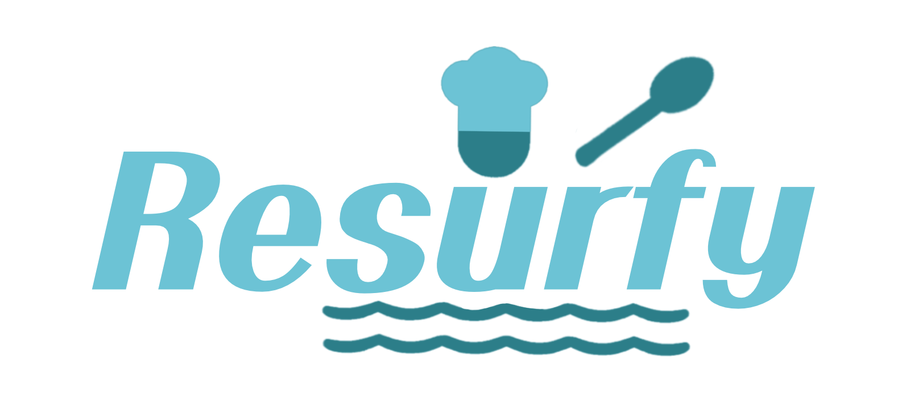

# 수정중...

# 📜Re-surfy

Refesta : 사용자간 레시피를 공유하고, 쇼핑을 중계하는 사이트

## 📅 진행 기간

2023.03.00 ~ 2023.05.09

## 🤝 팀원 소개

페이지(기능) 단위로 구분하여 백엔드, 프론트엔드 구현.

|                      팀장 김태언                      |                   팀원 이선주                   |                      팀원 이지원                       |                  팀원 정윤주                  |                         팀원 최기범                          |
| :------------------------------------------------------: | :------------------------------------------------: | :-------------------------------------------------------: | :----------------------------------------------: | :-------------------------------------------------------------: |
| 레시피 등록 | 로그인, 회원가입 | 마이페이지, 장바구니, 보유 재료 관리 | 레시피 상세, 레시피 수정·삭제 | 레시피 목록, 랭킹

## 🌍 프로젝트 소개

`"이 레시피 만들어보고 싶은데 따로 쇼핑하기 귀찮네"` 
`"집에 있는 재료로 만들 수 있는 레시피가 뭐가 있지?"`

 물가 상승으로 
 
 집밥에 대한 수요가 높아진 지금,

 바쁜 현대 사회에 
 
 레시피 검색과 쇼핑을 따로하거나,  냉장고에 있는 재료로 만들 수 있는 레시피를 고민하는 번거로움을 줄여줄!

 `Re-surfy`를 사용해보세요.

## 🎶 주요 기능

### 레시피 게시판

- 공공 데이터 포털에서 제공된 레시피 목록 열람
- 가입 사용자들이 직접 등록한 레시피
- 댓글을 통한 레시피 피드백 공유
- 카카오톡을 통한 레시피 링크 공유

### 재료 쇼핑 (중계)

- 네이버 검색 API 쇼핑 카테고리 활용
- 해당 레시피에 필요한 재료 쇼핑몰 링크 제공
- 장바구니 기능으로 한 번에 관리 

### 레시피 검색

- 기본 검색 및 필터링
- 보유 재료 선택을 통한 검색

### 보유하고 있는 재료 관리

- 자동 완성 검색을 통해 재료 등록
- 자동 완성 목록은 기존 레시피에 등록된 재료를 기반으로 보여짐
- 레시피 검색 결과의 정확도를 높임

## 🏛️ 프로젝트 구조도

## 💻 주요 기술

## 📃 프로젝트 산출물

- [프로젝트 노션](https://instinctive-talk-7a7.notion.site/Aticket-637a6f1875244119a8c89f14ed540b44?pvs=4)
- [화면 정의서](https://www.figma.com/file/bxs6l1zCnb9wPEKiLhj30e/%ED%8E%98%EC%8A%A4%ED%8B%B0%EB%B2%8C-%ED%94%84%EB%A1%9C%EC%A0%9D%ED%8A%B8?type=design&node-id=0-1&mode=design&t=oEZFw1x6hpYl0e2k-0)
- [API 명세서](https://www.notion.so/API-75a33ec196d343899287e49c6e081bdd)

## 📊 ERD 다이어그램

